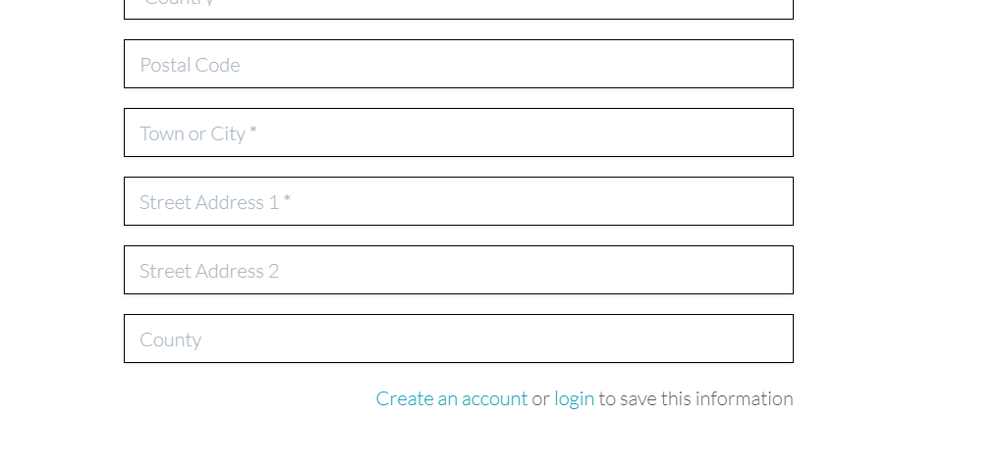
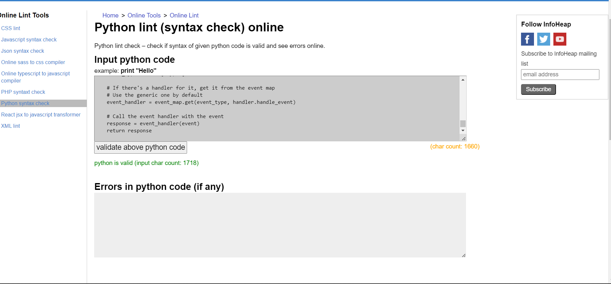
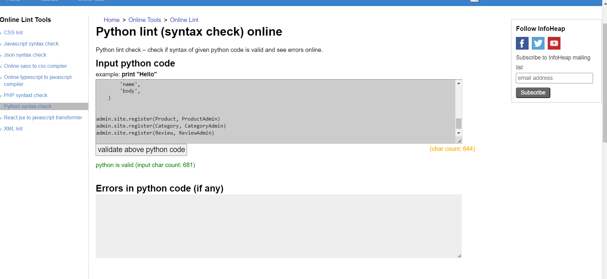
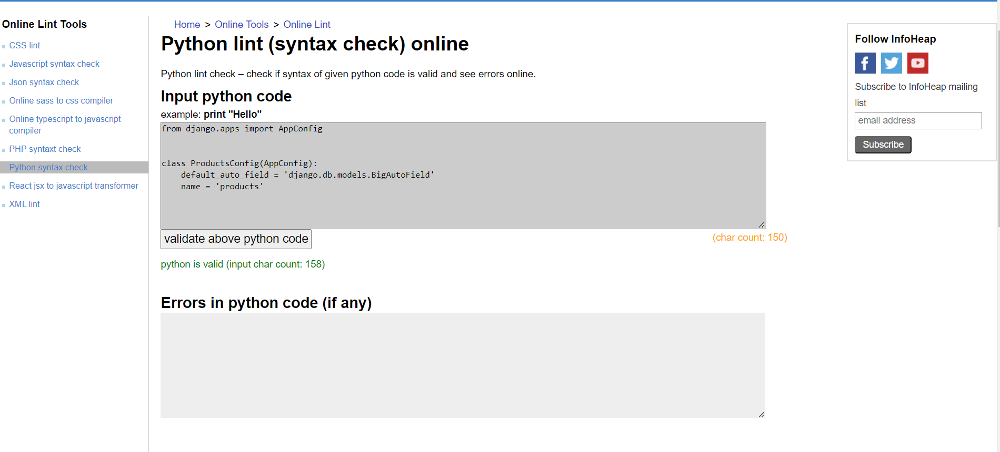

# Gifts Den

Gits den aims to be the one stop shop for all the gifts you need, for those special people in your life!

The wide scope name of the store was very much deliberate, in the sense that it gives potentially limitless rooms for expansion in the future, both in terms of prodct range and store size.

When building the store, I started off with some clothing, electrical and living style products, with the intension of expanding this in the future.

Please see the wireframes shots below to give you an idea of the general site layout and structure.

## Site Design (Wireframes) 

- Homepage

- Products page

- Products Detail Page

- Shopping bag page

- Checkout Page

- Order success page

- Product management page

- Profile Page

- Password reset screen

- Sign in form

- Sign Out form

## User stories/planning

I used Github's storyboard feature to assist me with the planning of this project, although, as with previous projects, I did need to add some stories while building the project to cater for additional features such as reviews, that I decieded to add after commencing work.

## Models

The project includes all Crud functionality as per requirements.

The main models within the project are:

Products consisting of:
- Category
- Product
- Review 
- Userprofile

- The Review model is an addition to the Code Institute Boutique Ado walkthrough project, which I used to help me build this project.

- I will also be ammending or possibly removing the rating field from the product model, as a user is unable to rate a project in it's current form and believe that the review model is more useful in this regard.

- I also added a date of birth field to the Userprofile model as I believe this will be useful in terms of any age restricted products that may be sold on the store in the future.

## Gifts Den Marketing Strategy

### PPC Advertising

On launch, our new Ecommerce store is not likely to get a lot of organic search engine trafic due to the fact that it is a new site, and could take several weeks or even months to gain any sort of position in relevent meaningful search terns.

To that end, I would like to target some longer tail, less competative keywords using PPC advertising.

### Long Tail Keywords

These long tail keywords would be product focused and I would like to bring the user directly to the page that their search is targeting.

Take a product we currently sell such as headphones.

If we were to target a keyword such as "buy headphones", this currently has search results in google ranging into the hundreds of millions, however, if we were to target a keyword such as "buy headphones with better battery life", this has search results in the 10 of millions, which would be much easier and cheaper to target using PPC.

### Organic SEO optimisation

I will be putting descriptive metatags and keywords into my base template in order to improve our organic search engine rankings, as per project requirements.

Once I have all final sample products in place, I will also be creating sitemap, and robots.txt from it for the search engines and submitting as needed.

### Newsletter

We already have a newsletter sign up form set up on our store's homepage. As we drive traffic to our site, initially through our budgeted PPC campagn and later, through our growing organic search results, we can send out a monthly or as the store gorws, even a weekty newsletter to let our subscribers know about any special offers and seals, and drive even more traffic to the site.

## Features

### Homepage

On the home page the user can:

- Search the site
- Login/out or register
- Select some products to view from the the top navbar or from the shop now button

Assuming our user is a new customer

- We will click on register.

- We are then brought to the resigistration screen to fill out our details.

- Once the user has filled out their details, they will click on the sign up button.

- They will then be brought back to the homepage and presented with a success message confirming successful registration.

- They will then need to confirm their email address via the email sent to the email address they registered.

### Purchasing a product

- Our newly created user, having confirmed their email address, will now be able to log into the store to make a purchase.

- Assuming our new user wanted to purchase some headphones, they would select electrical from the top nav bar and then select headphones.

- The user is then presented with a filtered list of all headphones available.

- Our user wishes to purchase the first set of headphones, selects them and is then presented with the product detail page.

- Once the user has selected the correct quantity and clicked add to bag, they will be greeted with a confirmation message confirming the headphones have been added to their shopping bag successfully.

- Asuming this is the only item they wish to purchase, they will then click on go to checkout and be presented with the checkout screen, with the majaority of their registeration information already filled out on the page.

- They will also have the option to select a tick box in case they wish to change any of their user profile information.

- They will then add their payment information and click on complete order.

- They will then be presented with an order success page and sent a confirmation email to confirm their order was processed successfully.

- The order process will differ slightly depending on weather the user is registered.

- If the user is not registered, they will need to fill out all their information in the checkout page, and if they they wish to register, they can simply select, create account, or login and will be brought to the registeration or login page and can then continue with their purchase.

## Profile Registration

- As Illustrated above, a user can either select register from the account menu or choose to go to the registration page from the checkout when making a purchase.

- They will then fill out the registration form and select sign up.

- They will then be brought back to the homepage with a message confirming they have been registered successfully.

### Editing user profile

- To edit their profile information, once logged in, the user can select the my profile option from the my account menu which will bring up their prfile page.

- They are then free to edit any of their info that they wish and update it by clicking the update information button.

- Their information will then be updated, and they will be greeted with a success message confirming this.

## Add/edit/delete a product 

- For convenience sake, store owners/administrators can also add or edit a product from their my account menu.

- It is worth noting however, that they must be set up as a superuser in order to do so.

- First, our user must select product management from the my account menu.

- They will then be presented with the product management screen.

- They can then add a product to the store, by filling out the product details and selecting add product.

- They will then be brought to the product detail page for the new product, while being greeted with a success message, confirming the product has been added successfully.

- Our user can also edit or delete a product by selecting the relevent option from the product detail screen.

- When editing a product, they will are presented with the prepopulated product screen and cen then edit any product details they need to.

- They will then click update product and will then see a message confiring the product has been edited successfully.

- To delete a product, they will simply select delete product from the product detail page of the product they wish to delete.

- Again, a success message will then confirm successful product deletion and the user will be brought back to the all products page.

### Filtering products by category

Products within the store can also be filtered by price, category or name, in forward or reverse order.

- As an example, our user selects electrical and then headphones.

- They are then greeted with a filtered list of products containing all headphones.

- A user can then filter them by price from high to low from the dropdown list.

- Price low to high

- Category A to Z

- Category Z to A

- Name A to Z

- Name Z to A

- This will drastically improve user experience enabling them to find the product they're looking for much quicker.

### Features for future implementation

- Would like to reintroduce the ratings system, but integrated with the the reviews feature. As it previously stood, ratings could not be altered by the user, hense I felt it was better to remove it for now.

- A contact us page form would be useful to both user and administrator, saving the need for the user to send an email. 

## Technologies used

- Python

- Django

- HTML

- CSS

- Javascript

- Gitpod (to build project)

- Heroku, Githib and Amazon S3 (for deployment)

- Microsoft visual studio code (to work on project while offline)

## Testing

I have completed a seperate test file [here](TESTING.md) which goes through all manual testing completed for this project.

### Validator testing

#### Main Gifts Den app:

- urls.py

- views.py

#### Home app:

- app.py

- views.py

#### Bag app:

- apps.py

- contexts.py

- urls.py

- views.py

#### Checkout app:

- admin.py

- apps.py

- forms.py

- models.py

- signals.py

- urls.py

- views.py

- webhookhandler.py

- webhooks.py

#### Products app:

- admin.py

- apps.py

- forms.py

- models.py

- urls.py

- views.py

- Widgets.py

#### Profiles app:

- apps.py

- forms.py

- models.py

- urls.py

- views.py

