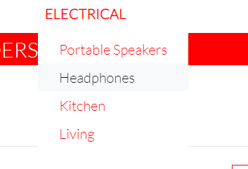
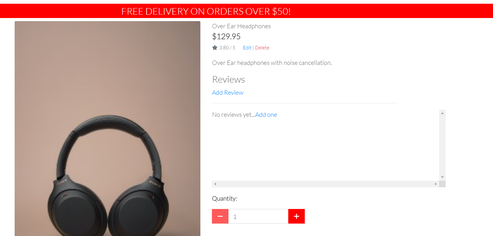
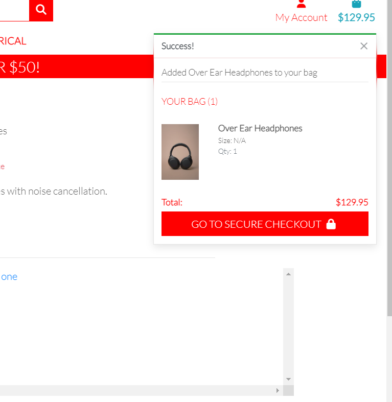
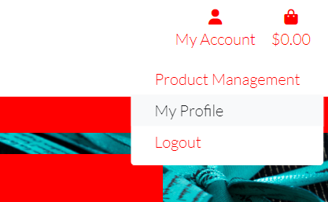
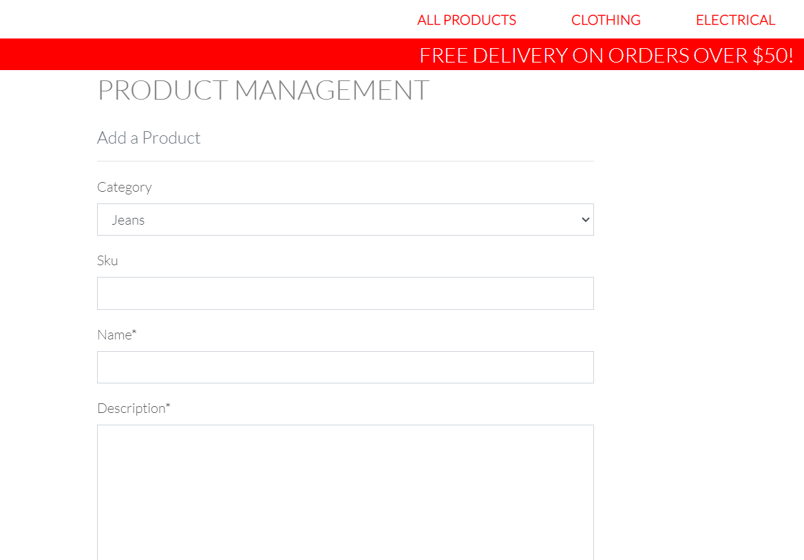
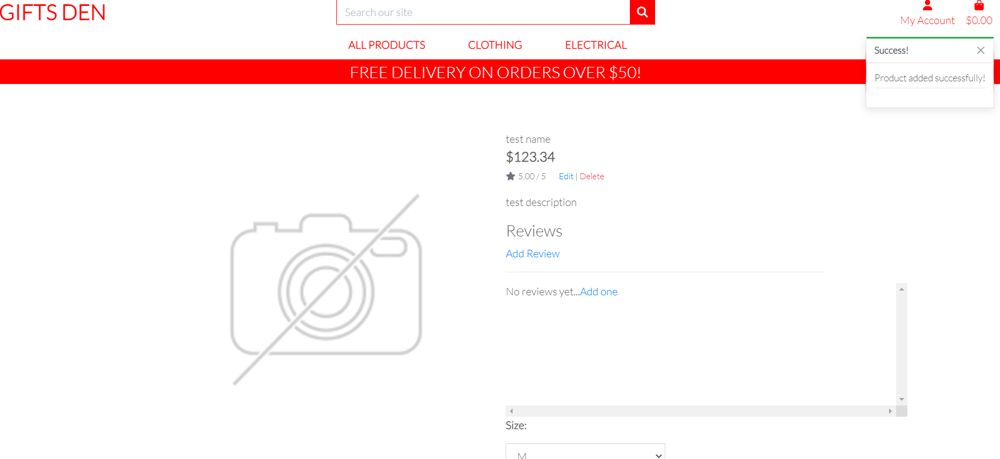
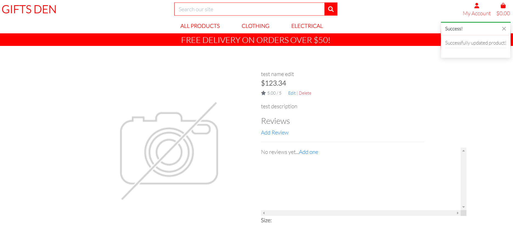
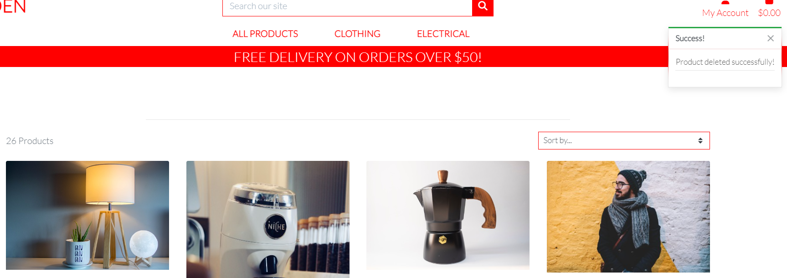
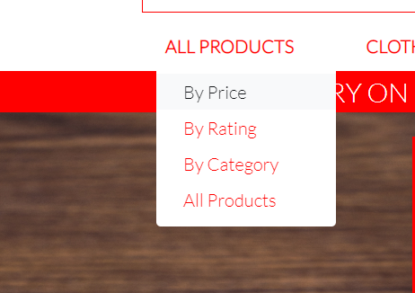

# Gifts Den Testing

## Login/Logout

The expected result of this test is that, when the user attempts to log into the application using their username and password, they will be logged in and presented with an on screen message confirming a successful login, with their my account dropdown menu, displaying the option to view their profile, logout and in the case of a superuser, go to the product management page.

When testing this featue I did the following:

- Click on my account at the top right of the screen and select login.

- When presented with the sign in screen, the Sign up/login screen text between the horizontal rule was missing.

- This was because of a previous change to the logo class to white to make the offer banner text visable.

- To rectify this, I added an id to override the class and changed the colour to suit.

- The sign in screen now displays as expected.

- I entered my credentials and was able to log in successfully.

- I next attempted to log out by selecting the my account menu again and selecting logout.

- I encountered the same issue with the h2 text between the horizontal rule as on the sign in page.

- Again I corrected this by adding an id to the h2 to pair it with the previous css for the sign in page.

- I was then able to sign out successfully.

## Register New Account

The expected result of this test is that the user will be able to register a new account and that within this process, they be sent an email verification in order to confirm their email address. Once the user confirms their email, they should be able to log in with their newly created credentials.

When testing this feature, I did the following:

- Click on the my account menu at the top right of the screen and select register.

- Again, I encountered the same issue as with the previous log in/out pages, so I added the same id to this template to correct also.

- I was then greeted with the confirm email screen, to which I again added the applicable id to correct the missing h2 text.

- The verification email was then sent to a temp email address as expected.

- Upon using the link, provided in this page, I was then greeted with a the next confirmation page with a button, asking me to click to confirm my email address. Again, I corrected the issue with the h2 by adding the correct id to the template.

- The I was then brought back to the login screen with an email confirmation success message.

- I was then able to log in using this email address without issue.

## Make a Purchase

The expexted result of this test is that, a user will be able to make a purchase on the site and they will receive a confirmation email to confirm their order has been received.

When testing this feature, I did the following:

 
 - Clicked on clothing and selected shirts.

 

 - I then selected shirts.

 

 - I then selected the first shirt and was presented with the relevent product detail page.

 

 

 - I then added the shirt to my shopping and selected go to checkout.

 

 - I was then presented with the shopping bag containing the shirt.

 - I then clicked on secure checkout.

 

 - I was then presented with the checkout screen and filled out some information for testing purposes.

 

 - I then clicked on complete order and was presented with the order success page as expected.

 

 - I also received a confirmation email for the order as expected.

 - I did have to make a change the logic in the order model within the checkout app, due to duplicate orders being generated with two last names instead of first and last names.

 - I removed the first_name and last_name logic and replaced with full_name on the model, views, forms and templates as needed and the app is now behaving as expected.

 ## Make a purchase as a previously registered user

 The expected result of this test is that when a previously registered user logs in, they would be able to make a purchase with their profile information prepopulated on the checkout page.

 When testing this feature I did the following:

 

 - Entered my correct credentials and clicked login.

 

 - I was then greeted with the sign in success message on the home page.

 

 - I then selected electrical and selected headphones.

 

 - I was then presented with a list of all the headphone products and selected the first.

 

- I was then presented with the product detail page for these headphones.

- I added these to my shopping bag and was then greeted with the success meesage advising the headphones had been added to my shopping bag successfully.

- Then clickaed go to checkout and the headphones were in my shopping bag.

- I was then presented with the checkout page which had all my test profile information populated with the exception of the full name, which is correct as per app logic.

- I filled out my name, completed the order and was greeted with the order success page.

- I was also sent a confirmation to both my gmail account and the development terminal as per current environment variables.

The app behaved as expected during this test.

## View/edit my profile and view order history

The expected of this test is to confirm that as a logged in and registered user, I can view and edit my profile information and also see my order history.

To perform this test, I did the following:

- While logged in, I clicked on my account and then selected my profile.

- I was then presented with my profile page, as well as my order history. 

- The order history did not present in chronalogical order however, so I wull look at this in future development.

- I then added my date of birth and changed my country to Ireland and was greeted with a success message confirming my profile had been updated.

- Another observation on this test is the fact that the date of birth saved in US format, which again, is an area that I will look at for furure development.

## Review a product

The purpose of this test is to confirm a user, weather logged in or not, can leave a review on a product and that the review is then visable to others. I would also want to confirm that the "no reviews yet...add one" text disappears once a review is added.

To complete this test, I did the following:

- Clicked on clothing while not logged in the selected jeans.

- I was then presented with the filtered jeans category page and selected the first pair.

- I was then greeted with the product detail page for these jeans and selected add review.

- I was then presented with the product review page, typed my test review and clicked on add review.

- I was then redirected back to the home page with the review success message.

- I was then able to view my test review as expected. One observation I made from this test however, was perhaps it would be better for user experience to redirect to the product detail page for the product they left the review on. Will look at this for future development.

## Add new product to store

The expected result of this test will be that a logged in super user will be able to add a product to the store without the need to use the django admin panel.

To carry out this test I did the following:

- I confirmed I was signed in as a superuser.

- I next selected product management from the my account menu.

- I was then greeted with the project management screen allowing me to add a test product with no image.

- With all my test info filled out, I selected add product.

- I was then brought to the product detail page for this newly added product, along with a message confirming the product had been added succesfully.

- I can also confirm that the newly added product came up with the vasious category filters when selected.

## Edit newly added product

The expected result of this test is that our super user will be able to edit a product in the store.

I tested this by doing the following:

- I selected the product I added in the previous test and was brought to it's product detail page.

- I then clicked on the edit option beside the product image.

- I then changed the sku and product name and clicked update product.

I was then brought back to the product detail screen and observed that the product name had updated as expected.

## Delete newly added product

The expected result of this test will be that a super user will be able to delete our newly added product from our store.

I completed this test by doing the following:

- From the product detail page of our test product, I this time selected delete product.

- I was then brought to the all products page with a message confirming that the product had been deleted.

- I was also able to confim this by selecting the others category and could see that our test product was no longer displayed.

## Filter products

The expected result of this test will be that the user will be able to filter all products by Category and price.

To conduct this test I did the following:

- I clicked on the all products menu and selected by price.

- I was then presented with a list of products from lowest price to highest price.

- I next selected price from high to low.

- As expected I was presented with a list of all products listed from the highest price to the lowest price.

- I repeated these steps for Category A-Z, Category Z-A, Name A-Z and Name Z-A and got the expected results.

- I was also able to filter all individual categories which displayed to the user as expected.

- I did not test the rating filtering, as I plan to refactor/remove this before submission.

