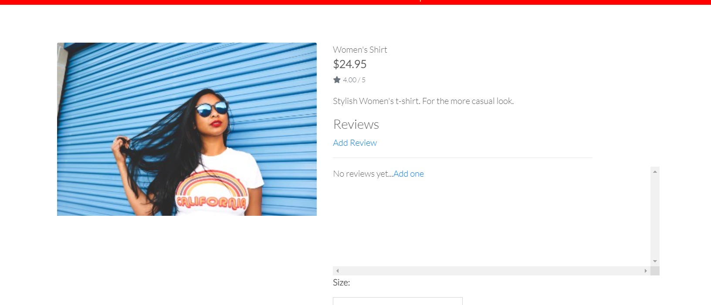

# Gifts Den Testing

## Login/Logout

The expected result of this test is that, when the user attempts to log into the application using their username and password, they will be logged in and presented with an on screen message confirming a successful login, with their my account dropdown menu, displaying the option to view their profile, logout and in the case of a superuser, go to the product management page.

When testing this featue I did the following:

- Click on my account at the top right of the screen and select login.

- When presented with the sign in screen, the Sign up/login screen text between the horizontal rule was missing.

- This was because of a previous change to the logo class to white to make the offer banner text visable.

- To rectify this, I added an id to override the class and changed the colour to suit.

- The sign in screen now displays as expected.

- I entered my credentials and was able to log in successfully.

- I next attempted to log out by selecting the my account menu again and selecting logout.

- I encountered the same issue with the h2 text between the horizontal rule as on the sign in page.

- Again I corrected this by adding an id to the h2 to pair it with the previous css for the sign in page.

- I was then able to sign out successfully.

## Register New Account

The expected result of this test is that the user will be able to register a new account and that within this process, they be sent an email verification in order to confirm their email address. Once the user confirms their email, they should be able to log in with their newly created credentials.

When testing this feature, I did the following:

- Click on the my account menu at the top right of the screen and select register.

- Again, I encountered the same issue as with the previous log in/out pages, so I added the same id to this template to correct also.

- I was then greeted with the confirm email screen, to which I again added the applicable id to correct the missing h2 text.

- The verification email was then sent to a temp email address as expected.

- Upon using the link, provided in this page, I was then greeted with a the next confirmation page with a button, asking me to click to confirm my email address. Again, I corrected the issue with the h2 by adding the correct id to the template.

- The I was then brought back to the login screen with an email confirmation success message.

- I was then able to log in using this email address without issue.

## Make a Purchase

The expexted result of this test is that, a user will be able to make a purchase on the site and they will receive a confirmation email to confirm their order has been received.

When testing this feature, I did the following:

 
 - Clicked on clothing and selected shirts.

 

 - I then selected shirts.

 

 - I then selected the first shirt and was presented with the relevent product detail page.

 

 

 - I then added the shirt to my shopping and selected go to checkout.

 

 - I was then presented with the shopping bag containing the shirt.

 - I then clicked on secure checkout.

 

 - I was then presented with the checkout screen and filled out some information for testing purposes.

 

 - I then clicked on complete order and was presented with the order success page as expected.

 

 - I also received a confirmation email for the order as expected.

 - I did have to make a change the logic in the order model within the checkout app, due to duplicate orders being generated with two last names instead of first and last names.

 - I removed the first_name and last_name logic and replaced with full_name on the model, views, forms and templates as needed and the app is now behaving as expected.

